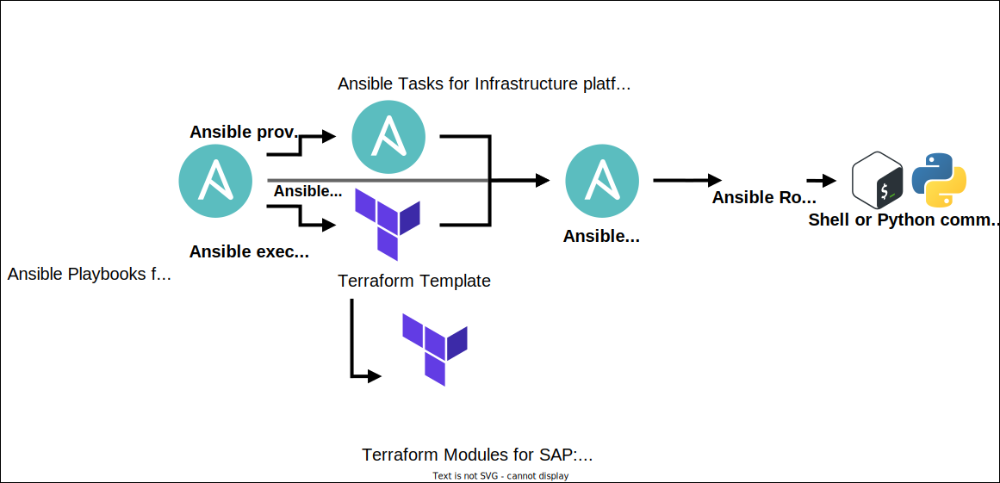

# Ansible Playbooks for SAP

## Description
This repository contains Ansible Playbooks for deployment of various SAP Software solution scenarios onto different Hyperscaler Cloud Service Providers and Hypervisors platforms.

## Benefits of Ansible Playbooks for SAP
The Ansible Playbooks for SAP offer several key benefits:
- **Ease of Use:** The playbooks are designed with simplicity in mind, making them accessible for users with varying levels of Ansible experience.
- **Highly Adaptable:** They are easily reconfigurable and extendable, allowing you to tailor deployments to your specific needs.
   - For example, you can customize them for specific SAP versions, integrate with monitoring tools, or adapt them to different network topologies.
- **Scenario-Specific and Self-Contained:** Each playbook encapsulates a complete deployment scenario, ensuring consistency and reducing complexity.
- **Consistent Across Platforms:** Deploy the same SAP solution across diverse infrastructure platforms (Hyperscaler Cloud Service Providers and Hypervisor platforms) with predictable results.
- **Infrastructure Flexibility:** Choose between Ansible or Terraform for infrastructure provisioning, providing flexibility in your deployment approach.
- **Corporate-Ready:** Licensed for corporate use by SAP Customers, SAP Service Partners, and SAP Technology Partners.

## Supported Configurations
### Supported Operating Systems
- SUSE Linux Enterprise Server for SAP Applications (SLES4SAP)
- Red Hat Enterprise Linux for SAP (RHEL4SAP)

### Supported Infrastructure Platforms
- AWS EC2 Virtual Server instances
- Google Cloud Compute Engine Virtual Machines
- IBM Cloud, Intel Virtual Servers
- IBM Cloud, Power Virtual Servers
- Microsoft Azure Virtual Machines
- IBM PowerVM Virtual Machines (LPARs)
- OVirt (e.g. Red Hat Enterprise Linux KVM)
- KubeVirt (e.g. Red Hat OpenShift Virtualization, SUSE Rancher with Harvester HCI) `[Experimental]`
- VMware vSphere Virtual Machines `[Beta]`
- Existing hosts without provisioning

### Supported Deployment Scenarios
| SAP Product | Versions | Deployment Topology | Database |
| --- | --- | --- | --- |
| SAP HANA | 2.0 SPS 08  2.0 SPS 07  2.0 SPS 06 | Sandbox  Scale-Out   Scale-Up High Availability | SAP HANA |
| SAP BW/4HANA | 2023  2021 | Sandbox  Scale-Out | SAP HANA |
| SAP S/4HANA | 2023  2022  2021  2020 | Sandbox  Standard  Distributed  Distributed with High Availability | SAP HANA |
| SAP S/4HANA  Maintenance Plan | Any version - Defined by Maintenance Plan  Includes latest FPS and security patches | Sandbox  Standard  Distributed  Distributed with High Availability | SAP HANA |
| SAP S/4HANA Foundation | 2023  2022  2021 | Sandbox  Standard | SAP HANA |
| SAP Landscape for SAP S/4HANA | 2023  2022  2021  2020 | 3-System Standard | SAP HANA |
| SAP Landscape for SAP S/4HANA  Maintenance Plan | Any version - Defined by Maintenance Plan  Includes latest FPS and security patches | 3-System Standard | SAP HANA |
| SAP Business Suite (ECC) | EHP 8  EHP 7 | Sandbox | SAP HANA |
| SAP Business Suite (ECC) | EHP 8 | Sandbox  Distributed (IBM Db2) | IBM Db2  Oracle DB  SAP ASE  SAP MaxDB |
| SAP IDES for ECC | EHP 8 | Sandbox | SAP HANA, IBM Db2 |
| SAP NetWeaver ABAP | 7.52 SP00  7.50 SP00 | Sandbox | SAP HANA  IBM Db2  Oracle DB  SAP ASE  SAP MaxDB |
| SAP NetWeaver JAVA | 7.50 SP22 | Sandbox | IBM Db2  SAP ASE |
| SAP Solution Manager ABAP/JAVA | 7.2 SR2 | Sandbox | SAP HANA  SAP ASE |

> Note: Additional SAP Product versions can be added by customizing extra vars file.  

The explanation of Deployment Topologies:
| Deployment Topology | Definition |
| --- | --- |
| Sandbox | A single-host system, that consolidates all SAP Database and SAP ABAP Platform instances onto a single host |
| Standard | A standard system, that consists of the SAP Application running on a dedicated host, and an SAP Database server running on another dedicated host |
| Distributed | A distributed SAP system, that separates the SAP Application components from the database server, placing them on distinct hosts |
| Distributed with High Availability | A distributed SAP system with High Availability (HA), that separates the SAP Application components from the database server, placing them on distinct hosts |
| Scale-Out | An Scale-Out system, that consists of an SAP Application instances running on a dedicated host, and an SAP HANA database server running as a scale-out cluster across multiple hosts. |

### Supported Special Playbooks
- SAP Web Dispatcher, Standalone (with SAP Kernel Part II for SAP HANA)
- SAP SolMan Diagnostics Agent (SDA) `[Experimental]`
- Download SAP Software installation media
- System Copy Export, IBM Db2 `[Experimental]`
- System Copy Restore (SAP ECC on HANA or SAP S/4HANA), Sandbox  `[Experimental]`
- SAP ASCS/ERS Cluster Installation

## How to get started
**Before running the playbook, please read the [full documentation](/docs#readme) for how-to guidance, requirements, and all other details.**  
- Ensure that the password variables are defined following [Prepare the Password Variables](/docs#prepare-the-password-variables).  
- Ensure that the variables with placeholder values are correctly defined. Placeholder value can be recognized as `ENTER_STRING_VALUE_HERE`.

The playbooks can be executed with one of following methods.

### Ansible with existing host(s)
This method is used to install the SAP system on an existing host(s).  
- **Interactive Prompts:** Yes :white_check_mark:
- **Provisioning:** No :x:
- **SAP Installation:** Yes :white_check_mark:
- **Required Variables:**
   - `sap_vm_provision_iac_type: ansible`
   - `sap_vm_provision_iac_platform: existing_hosts`
- **Host definition:** The existing hosts are defined using:
   - Ansible inventory file (e.g. `optional/ansible_inventory_noninteractive.yml`).
   - The `sap_vm_provision_existing_hosts_host_specifications_dictionary` variable defined in `optional/ansible_extravars_existing_hosts.yml` file.

#### Prerequisites for existing host(s)
Control Node:
- The `.ssh/known_hosts` file on the Ansible Control Node (under the execution user's home directory) must contain entries for the existing hosts.
  - Ensure `ssh-keyscan` has been executed for the IP address or alias that corresponds to the host parameter defined in your Ansible inventory file. This ensures the control node can securely identify the managed hosts.

Managed Nodes (existing hosts):
- The firewall on the managed node must allow incoming SSH communication (typically TCP port 22) from the Ansible Control Node.
- The `/root/.ssh/authorized_keys` file must be correctly configured to allow SSH access from the Ansible Control Node.
   - The public SSH key from the Ansible Control Node must be added to the `/root/.ssh/authorized_keys` file on the managed node.
- The `/etc/hosts` file must contain host's fully qualified domain hostname to determine `ansible_domain`, or set through `sap_domain` variable.
- The `/etc/hosts` file must contain Virtual IP address for High Availability scenarios for SWPM execution (`sap_swpm` role).

### Ansible provisions host(s)
This method provisions a new host(s) and installs the SAP system. 
- **Interactive Prompts:** Yes :white_check_mark:
- **Provisioning:** Yes :white_check_mark:
- **SAP Installation:** Yes :white_check_mark:
- **Required Variables:**
   - `sap_vm_provision_iac_type: ansible`
   - `sap_vm_provision_iac_platform` for your selected Infrastructure Platform (e.g. `aws_ec2_vs` for AWS).
- **Host definition:** The provisioned hosts are defined using:
   - `host_specifications_dictionary` variable defined in extra vars file.
   - Example for AWS: `sap_vm_provision_aws_ec2_vs_host_specifications_dictionary` variable in `ansible_extravars_aws_ec2_vs.yml` file.

### Ansible uses Terraform to provision minimal landing zone and host(s)
This method provisions a minimal landing zone and a new host(s) using Terraform and installs the SAP system using Ansible. 
- **Interactive Prompts:** Yes :white_check_mark: `[Experimental]` (Limited support for Terraform variables)
- **Provisioning:** Yes :white_check_mark:
- **SAP Installation:** Yes :white_check_mark:
- **Required Variables:**
   - `sap_vm_provision_iac_type: ansible_to_terraform`
   - `sap_vm_provision_iac_platform` for your selected Infrastructure Platform (e.g. `aws_ec2_vs` for AWS).
- **Host definition:** The provisioned hosts are defined using:
   - The `host_specifications_dictionary` variable defined in extra vars file.
   - Example for AWS: `sap_vm_provision_aws_ec2_vs_host_specifications_dictionary` variable in `ansible_extravars_aws_ec2_vs.yml` file.
> Note: Ansible Playbooks for SAP optionally use Ansible > Terraform. To instead use Terraform > Ansible, see [Terraform Templates for SAP](https://github.com/sap-linuxlab/terraform.templates_for_sap)

## Interactive Prompts
Interactive prompts are available for most of the deployment playbooks.  

Exceptions include: S4/HANA Landscape and Solution Manager.

This mode is recommended if you need help entering all required variables in extra vars files.
- It will prompt for all undefined variables.
- It will validate all defined variables and those obtained from prompts.

How to execute Interactive Prompts mode:
1.  **Prepare the `optional/ansible_extravars_interactive.yml` file:** This file contains the essential set of variables for initiating Interactive Prompts.
2.  **Execute the playbook:** Run the following command `ansible-playbook ansible_playbook.yml --extra-vars "@./optional/ansible_extravars_interactive.yml"`

## Workflow diagram of playbook execution

## Disclaimer
These Ansible Playbooks for SAP provide Infrastructure-as-Code (IaC) and Configuration-as-Code (CaC) automation for common SAP software solution scenarios. They offer a codified approach to streamline and standardize deployments, which can be extended to meet specific requirements.  

These playbooks are not intended to replicate every possible SAP software deployment scenario, nor do they replace existing SAP installation procedures detailed in the [SAP Help Portal](https://help.sap.com) or [SAP Notes on SAP ONE Support](https://launchpad.support.sap.com). While the Ansible Role for SAP SWPM enables the installation of any SAP software supported by SAP Software Provisioning Manager (SWPM 1.0/2.0), always refer to official SAP documentation for the most accurate and up-to-date guidance.  

These playbooks are valuable for accelerating tasks such as rapid provisioning and testing (e.g., evaluating the latest software releases, applying patches, or performing system copy restores in cloud environments). They can be adapted to suit these needs.  

For comprehensive lifecycle management of SAP systems, consider [SAP Landscape Management Enterprise Edition](https://www.sap.com/uk/products/landscape-management.html).  

For evaluating SAP software business functionality, [SAP Cloud Appliance Library](https://www.sap.com/products/cloud-appliance-library.html) offers a convenient platform.

### Pseudo-Idempotency
Idempotency ensures that applying the playbook multiple times results in the same system state as applying it once.  
While these playbooks strive for idempotency, certain limitations exist.

Potential issues:
1. **NFS Mounts:**
   - The playbooks mount NFS shares but do not currently validate or purge existing mounts.
   - Re-running the playbook without cleaning up previous NFS mounts may lead to SAP Software Provisioning Manager (SWPM) failures or unexpected behavior due to the presence of existing SAP directories.
2. **SAP System Detection:**
   - The `sap_swpm` Ansible role, used for SAP software installation, may fail or produce inconsistent results if it detects an existing SAP system on the target host.
   - To avoid issues, use the playbooks on fresh systems or ensure thorough cleanup of any previous SAP installations.

## License
[Apache 2.0](./LICENSE)

## Contributors
Key contributors are shown within the [contributors](./docs/CONTRIBUTORS.md) file.

## Contributing
You can find more information about ways you can contribute at [How to contribute](./docs/CONTRIBUTING.md).
